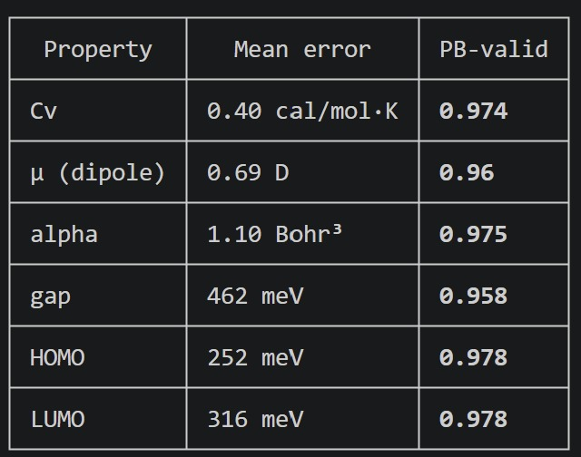
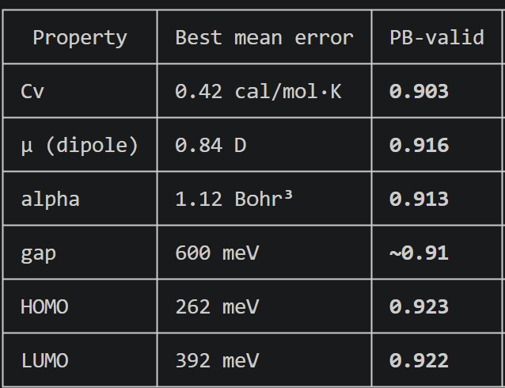

# MultiMFM

**Inference-time steering with meta flow maps, for molecules and for DNA.**


**Authors:** Franklin Shiyi Wang and Ulrik Unneberg (equal contribution).
Kempner Institute, Harvard University.


MultiMFM steers a pretrained generator toward a target property *at inference
time* — no property-conditional retraining. A distilled **meta flow map (MFM)**
gives a cheap few-step posterior estimate, which turns a property regressor into a
value gradient. The repository ships two instantiations:

| | Modality | Target property | Code | Checkpoints |
|---|---|---|---|---|
| **multiMFM** | continuous coordinates + discrete atom types (QM9) | polarizability, heat capacity, dipole, HOMO / LUMO / gap | `src/multimfm`, `src/tabasco` | `checkpoints/base_flow`, `checkpoints/mfm_student*` |
| **dMFM** | discrete DNA sequences over `{A,C,G,T}` | loop-seq cyclizability (C0) | `src/dmfm` | `checkpoints/dna/` |

Both distil the same GLASS posterior and steer with the same value-gradient
estimator; they differ in the base generator and in what a "clean sample" is.
For molecules, **`steer_search`** additionally selects the best
PoseBusters-valid molecule along each guided trajectory.


<p align="center">
  
  &nbsp;&nbsp;
  
</p>

## Method

1. **Base flow model** — a TABASCO discrete-flow-matching (DFM) transformer trained
   unconditionally on QM9 (`checkpoints/base_flow/`).
2. **Meta flow map (MFM)** — a flow-map "student" distilled from the base model's
   GLASS posterior. It maps a noisy state to a fast few-step clean-sample estimate,
   used as the **value sampler** during guidance (`checkpoints/mfm_student/`).
3. **Value-gradient guidance (GLASS)** — at each sampling step, guide the velocity by
   `∇ₓ log E[exp(λ·r) | xₜ]` with reward `r = -(predicted_property - target)²`,
   estimated with the MFM student and a differentiable property **guide** regressor.
4. **`steer_search` (SS)** — the `return_best` variant. At every in-window step the
   model exposes a look-ahead clean-sample endpoint; `steer_search` harvests them,
   keeps only those that pass PoseBusters, and returns the valid endpoint whose
   guide-predicted property is closest to target. This lifts both validity and
   accuracy over returning the final endpoint.

Property accuracy is reported against a held-out **oracle** regressor (never used for
steering) alongside PoseBusters validity.

For **DNA** the same four stages apply, with the molecular pieces swapped out: the base
model is a DFM DiT denoiser over `{A,C,G,T}` (`checkpoints/dna/base/L{50,100,200,400}`),
the student is the dMFM (`checkpoints/dna/dmfm/`), the reward is a loop-seq cyclizability
(C0) regressor, and there is no PoseBusters filter — so the DNA runs report oracle C0
error and sequence-diversity diagnostics instead. The C0 **guide** and **oracle** are
trained on disjoint halves of the parent sequences (`checkpoints/dna/c0/{guide,oracle}`),
so the scorer never sees the steering signal.

## Results — QM9 (n = 1000 per run)

Held-out **oracle** error, averaged over PoseBusters-valid molecules, for the shipped
configuration (the CE/ESD student sampled with 4 flow-map jumps). `multiMFM` returns the
final trajectory endpoint; `multiMFM-SS` returns the best PB-valid look-ahead from the
same run. Per-property configs are in `configs/steer/qm9_table2.tsv`.

| Property   | multiMFM | PB-valid | multiMFM-SS | PB-valid |
|------------|----------|:--------:|-------------|:--------:|
| Cv         | 0.44 cal/mol·K | 0.905 | 0.43 cal/mol·K | 0.984 |
| μ (dipole) | 0.56 D   | 0.913    | 0.56 D      | 0.962    |
| α (alpha)  | 1.05 Bohr³ | 0.925  | 0.99 Bohr³  | 0.985    |
| gap        | 465 meV  | 0.918    | 450 meV     | 0.984    |
| HOMO       | 238 meV  | 0.902    | 238 meV     | 0.981    |
| LUMO       | 306 meV  | 0.906    | 274 meV     | 0.972    |

Each row is the mean over 1–4 replicate runs of 1000 molecules. Steer-search raises
validity on every property and lowers the error on four of the six. **Reproducibility:**
runs are not bit-reproducible by default — identical configs and seeds can differ by up
to ~12% in reported error, because non-deterministic reductions in the autograd backward
move molecules across PoseBusters thresholds. Pass `DET=1` to
`scripts/reproduce_steer_table.sh` for exactly repeatable numbers (~15% slower).

## Models — DNA (dMFM)

Four sequence lengths, each with a base DFM teacher and a distilled dMFM student:

| Checkpoint | L = 50 / 100 / 200 / 400 | Role |
|---|:--:|---|
| `checkpoints/dna/base/L*/best.pt` | ✓ | base DFM denoiser over `{A,C,G,T}` (teacher) |
| `checkpoints/dna/dmfm/L*/*.ckpt` | ✓ | dMFM student (diagonal + ESD) |
| `checkpoints/dna/dmfm_4step/L*/*.ckpt` | ✓ | 4-step dMFM student |
| `checkpoints/dna/dmfm_lineage/L400_diagonal/` | L400 | diagonal-only finetune of the L400 student |
| `checkpoints/dna/c0/guide/best_state.pt` | L50 | cyclizability (C0) regressor used for **steering** |
| `checkpoints/dna/c0/oracle/best_state.pt` | L50 | held-out C0 regressor used only for **scoring** |

The C0 guide and oracle are trained on disjoint halves of the parent sequences
(`a_train` / `b_train`), so the scorer never sees the steering signal.

## Setup

Requires [micromamba](https://mamba.readthedocs.io/) and (for guided sampling) a CUDA GPU.

```bash
micromamba env create -f environment.yml   # creates the `multimfm` env
micromamba activate multimfm
```

The single `multimfm` env covers **both** experiment families (QM9/GEOM molecules and
DNA). If only `conda`/`mamba` is available, `conda env create -f environment.yml` works
too and `scripts/env.sh` falls back to `conda activate`.

`scripts/env.sh` activates the env and wires up the bundled QM9 dataset (offline
Hugging Face cache) and CUDA runtime libraries:

```bash
source scripts/env.sh
```

## Usage

### Steer toward a property with `steer_search`

```bash
# reproduce all six properties from the shipped configs (3 seeds each, deterministic)
scripts/reproduce_steer_table.sh
python3 scripts/steer_table.py          # per-property detail + LaTeX rows

# one property, or call the module directly
scripts/reproduce_steer_table.sh alpha
python -m multimfm.steer_search --property-name alpha \
    --mfm-checkpoint checkpoints/mfm_student_ce_esd/student_step_100000.pt \
    --mu 15 --reward-scale 0.15 --select-min-t 0.6 \
    --guidance-max-coord-rms 0.3 --guidance-max-atom-rms 0.3 \
    --num-samples 1000 --deterministic
```

`--select-min-t` is the earliest time a look-ahead may be selected by steer-search, and
is what makes it beat the final endpoint; values ≤ 0.5 did not win reliably.

Defaults point at the bundled checkpoints; results (oracle MAE + PB-valid for the final,
raw-best, and PB-valid-best endpoints) are written to `outputs/steer_search/<property>/`.

### Training

```bash
# 1) base QM9 flow-matching model  -> checkpoints/base_flow/
python -m multimfm.train_base_flow --device cuda

# 2) distill the meta flow map from the base model -> checkpoints/mfm_student*/
#    --atom-loss-type ce matches the atom meta denoiser to the teacher's psi_{t*}
#    with soft-label cross entropy (Prop. 1); mse regresses atom velocities.
#    --time-encoding-max-len 4 is required for stable ESD (see below).
python -m multimfm.train_mfm_student --device cuda --stage 1 --init-from-teacher \
    --atom-loss-type ce --time-encoding-max-len 4
python -m multimfm.train_mfm_student --device cuda --stage 2 --init-ckpt <stage1.pt> \
    --atom-loss-type ce --time-encoding-max-len 4
```

The shipped `checkpoints/mfm_student_ce_esd/` student was trained this way. The
off-diagonal ESD term diverges with the default high-frequency time embedding; capping
it with `--time-encoding-max-len 4` is what makes it trainable.

Both read QM9 from the bundled offline cache under `data/qm9/`.

### Training the DNA models

Sequence lengths L = 50, 100, 200 and 400 each have a base DFM and a dMFM student.
Data and both C0 regressors are bundled, so the students can be re-distilled directly.
The Slurm wrappers submit to `kempner_requeue` under `kempner_grads`:

```bash
# 1) base DFM denoiser over {A,C,G,T}      -> checkpoints/dna/base/L<L>/
LENGTH=50 sbatch scripts/dna/train_base_dfm.sbatch

# 2) C0 guide + oracle regressors          -> checkpoints/dna/c0/{guide,oracle}/
sbatch scripts/dna/train_c0_regressors.sbatch

# 3) distil the dMFM student from the base -> outputs/dna/<run_name>/
LENGTH=50 sbatch scripts/dna/train_dmfm.sbatch
```

The dMFM objective is diagonal GLASS distillation plus a teacher-anchored ESD
consistency term. The diagonal term has two forms, selected with
`--mfm_diag_atom_loss`:

- `velocity` (default, the shipped checkpoints) regresses the GLASS posterior velocity
  under an adaptive pseudo-Huber loss.
- `ce` instead matches the meta denoiser `Psi_{s,s}` to the teacher's `psi_{t*}(S)` with
  soft-label cross entropy — the discrete analogue of Prop. 1, and the same objective as
  `--atom-loss-type ce` in the QM9 student. Both share the same optimum; CE acts on the
  logits, so its gradient does not vanish when the softmax saturates near a vertex.

```bash
# short end-to-end check of either objective (400 steps)
ATOM_LOSS=ce       MAX_STEPS=400 sbatch scripts/dna/train_dmfm_ce_smoke.sbatch
ATOM_LOSS=velocity MAX_STEPS=400 sbatch scripts/dna/train_dmfm_ce_smoke.sbatch
```

## Repository layout

```
src/tabasco/            Base flow-matching library (backbone, GLASS sampler, MFM transformer)
src/multimfm/           Steering + training drivers
  steer_search.py         steer_search (SS): PB-valid best-of-lookahead selection
  glass_guidance.py       value-gradient guidance core
  glass_posterior.py      GLASS posterior / endpoint prediction
  glass_endpoints.py      data endpoints + condition-state helpers
  qm9_data.py             QM9 loading + TFG-Flow guide/oracle regressors
  property_targets.py     length-conditioned property-target histograms
  train_base_flow.py      base DFM trainer  (+ shared utilities)
  train_mfm_student.py    meta-flow-map distillation trainer
  model_loading.py        checkpoint -> model loader
src/dmfm/               DNA (dMFM) library and experiment drivers
  models/dna_models.py    base DFM denoiser, dMFM student, MFM teacher adapter
  models/dit_seq.py       sequence DiT backbone
  lightning/dna_module.py Lightning module (DFM VFM loss and dMFM distillation)
  utils/mfm_diag_distill.py  diagonal GLASS distillation + ESD consistency
  utils/parsing.py        all DNA flags
  experiments/            train_base_dfm.py, train_dmfm.py, train_c0_regressor.py,
                          C0 guidance/sampling, Evo 2 scoring, diversity eval
  regressors/             C0 (cyclizability) regressor
  _mfm/                   Vendored MFM reference used by the DNA distiller
third_party/tfg_flow/   Vendored TFG-Flow regressor (EGNN Predictor) — see THIRD_PARTY.md
mfm/src/                Vendored MFM reference (GLASS distillation target)
checkpoints/            base_flow/, mfm_student*/, regressors/{guide,oracle}
  dna/base/L{50,100,200,400}/    base DFM denoisers (teachers)
  dna/dmfm/L{50,100,200,400}/    dMFM students
  dna/dmfm_4step/                4-step dMFM students
  dna/c0/{guide,oracle}/         cyclizability regressors (disjoint parent halves)
data/qm9/               QM9 offline Hugging Face cache (downloaded on first use)
data/dna/               loop-seq yeast windows + parent-disjoint splits (L = 50-400)
cache/histograms/       cached length-conditioned property-target histograms
configs/steer/          per-property QM9 steering configs behind Table 2
scripts/                env.sh, run_steer_search.sh, steer_*.sh
scripts/dna/            DNA Slurm wrappers (train_base_dfm, train_dmfm, C0, ...)
tests/dna/              DNA unit tests (pytest tests/dna)
```

## Data & weights

All checkpoints and the DNA datasets are stored with [Git LFS](https://git-lfs.com/)
(`.gitattributes`), about 0.93 GB in total. After cloning:

```bash
git lfs pull     # checkpoints + DNA data
```

**QM9 is not shipped** — it downloads automatically on first use into the offline cache
under `data/qm9/` (~0.54 GB), wired up by `scripts/env.sh`. To pre-fetch it:

```bash
source scripts/env.sh
python -c "from datasets import load_dataset; load_dataset('yairschiff/qm9', split='train')"
```

The **DNA data is shipped** because rebuilding it requires the raw loop-seq assay file
(`data/raw/yeast_sequences.txt`, from Basu et al. 2021), which is not redistributed
here. Given that file, `python -m dmfm.experiments.prepare_yeast_parent_splits`
regenerates the window tensors; the shipped `*_split_seed0.pt` index files pin the exact
parent-disjoint split so a rebuild reproduces it.

## Verification status

- **QM9 steering** — all six properties reproduced at n = 1000 from `configs/steer/`.
- **DNA training** — the documented path (`scripts/dna/train_dmfm.sbatch`, 4 dataloader
  workers with periodic validation) runs end to end for both diagonal objectives. On the
  preemptible `kempner_requeue` partition a job occasionally stalls after a validation or
  at teardown; resubmit if one goes quiet.
- **DNA checkpoints** — shipped as trained for the paper, all with the `velocity`
  diagonal objective. `--mfm_diag_atom_loss ce` is a newer option that trains correctly
  but has no shipped checkpoint yet.

## Attribution & license

MIT-licensed. Builds on and vendors **TABASCO** (base flow model, MIT), **TFG-Flow**
(property regressors, ICLR 2025, MIT), a **Meta Flow Map** reference implementation, and
**Dirichlet Flow Matching** (the DNA DFM trainers in `src/dmfm/experiments` are ported
from it). DNA data derive from the loop-seq cyclizability assay of Basu et al. (2021).
See [THIRD_PARTY.md](THIRD_PARTY.md).
